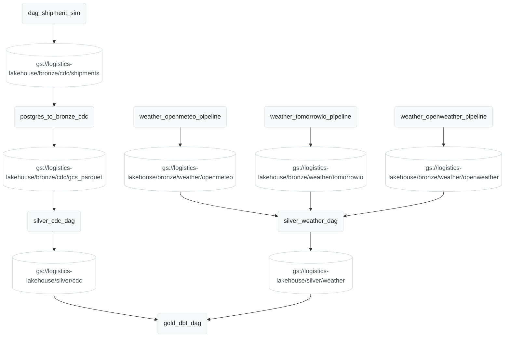
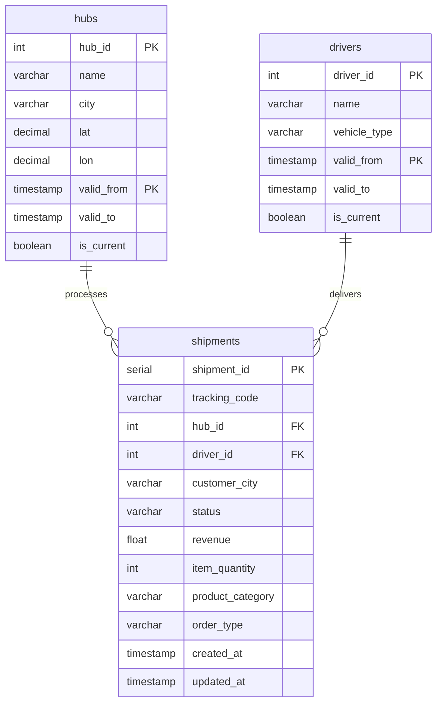
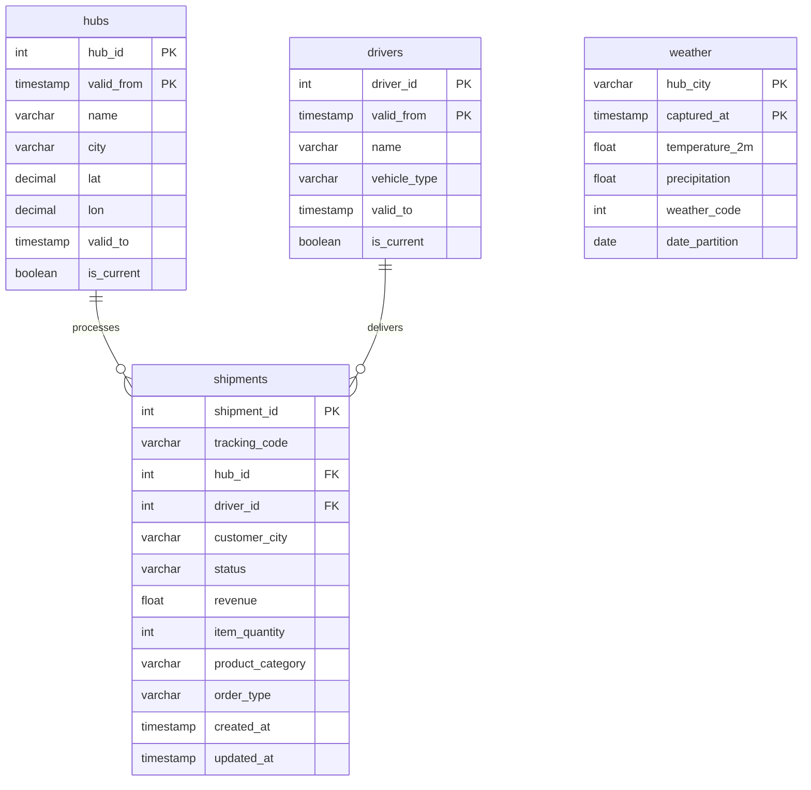
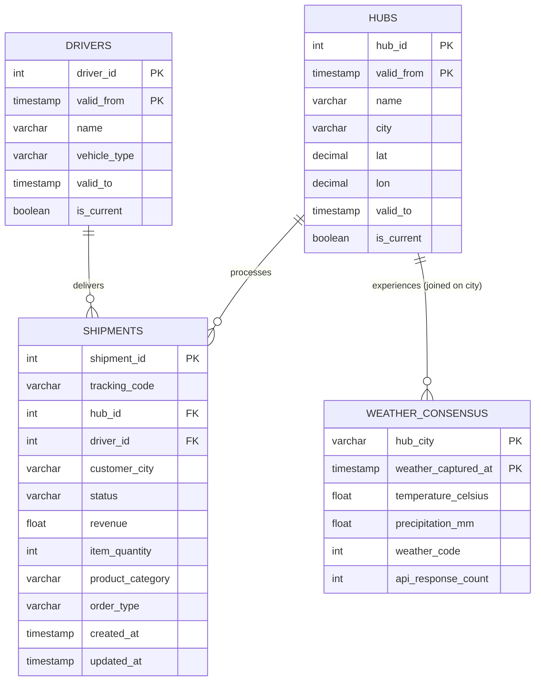
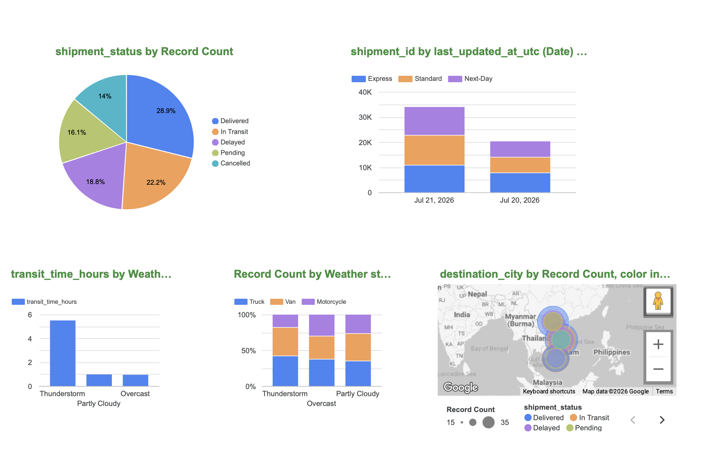

# Basic logistic pipeline project
This project was built primarily as a hands-on practice exercise to explore modern data engineering concepts. While this was created as a personal learning environment, it successfully implements several production-grade patterns—such as idempotent Upsert (MERGE) architecture, live API integration, and BigQuery Materialized Views—to simulate a real-world, end-to-end analytics infrastructure.

## Table of contents
- [Overview](#overview)
- [Architecture](#architecture)
- [Pipeline Flow](#pipeline-flow)
- [Tech Stack](#tech-stack)
- [Project Structure](#project-structure)
- [Layer Schema](#layer-schema)
- [Setup Guide](#setup-guide)
- [Running the Pipeline](#run-pipeline)
- [DAG Reference](#dag-reference)
- [Dashboard](#dashboard)
  

## Overview

Logistics Lakehouse simulates an end-to-end data platform for a regional delivery network operating across major Vietnamese cities. The pipeline:

- **Ingests** operational data (shipments, drivers, hubs) through a Python simulator acting as a CDC stream into PostgreSQL.
- **Enriches** logistics tracking data with **real-time weather consensus modeling** by aggregating live data from Tomorrow.io, OpenWeather, and Open-Meteo.
- **Extracts** Postgres and API data into a **GCS Bronze Layer** as Parquet files.
- **Processes** the raw data into **Apache Iceberg** format via PySpark, dynamically mounting the active metadata (`version-hint.text`) into Google BigQuery as External Tables.
- **Transforms** data through Bronze → Silver → Gold layers entirely managed by **dbt-bigquery**.
- **Visualizes** operations through a Looker Studio Command Center showing dual-currency revenue (USD/VND) and weather-driven supply chain impacts.

The core hypothesis being modeled: *severe weather (thunderstorms/rain/dusty) → higher delay probabilities and longer transit times; clear weather → optimal delivery rates and faster fulfillment.*

## Architecture 
```
┌─────────────────────────────────────────────────────────────────────────┐
│                          DATA SOURCES                                   │
│                                                                         │
│  PostgreSQL (Local Simulator)       Weather APIs                        │
│  ├── shipments (CDC)                ├── OpenWeather                     │
│  ├── hubs (CDC)                     ├── Open-Meteo                      │
│  └── drivers (CDC)                  └── Tomorrow.io                     │
│                                                                         │
└──────────────┬──────────────────────────────┬───────────────────────────┘
               │ Pandas / Python              │ Python / REST API
               │ (Hourly Extract)             │ (Hourly Fetch)
               ▼                              ▼
┌─────────────────────────────────────────────────────────────────────────┐
│                    BRONZE LAYER — GCS Raw Parquet                       │
│  gs://{bucket}/bronze/cdc/{table}/                                      │
│  gs://{bucket}/bronze/weather/{api_name}/                               │
│                                                                         │
│  Format: Parquet (Microsecond-precision)   No transformation applied    │
└──────────────┬──────────────────────────────────────────────────────────┘
               │ PySpark (Airflow Dataset Triggered / Cache-Disabled)
               ▼
┌─────────────────────────────────────────────────────────────────────────┐
│                  SILVER LAYER — Apache Iceberg on GCS                   │
│  gs://{bucket}/iceberg/silver/                                          │
│  ├── shipments  (Overwrite — accumulating order history)                │
│  ├── hubs       (Overwrite — latest 1-to-1 dimensional state)           │
│  ├── drivers    (Overwrite — latest 1-to-1 dimensional state)           │
│  └── weather    (Append — wildcard batch from all 3 APIs)               │
│                                                                         │
│  ACID · Version-hint tracking · Schema evolution · Storage-backed       │
└──────────────┬──────────────────────────────────────────────────────────┘
               │ bq_sync.py (Updates BQ pointer via version-hint.text)
               ▼
┌─────────────────────────────────────────────────────────────────────────┐
│                    GOLD LAYER — BigQuery Native (dbt)                   │
│  Dataset: logistics_mart                                                │
│  ├── stg_weather_consensus  (dbt view  — 3-API hourly voting consensus) │
│  ├── fact_shipment_weather  (dbt table — shipment grain, enriched)      │
│  └── realtime_order_stats   (dbt view  — dual-currency KPIs & counts)   │
└─────────────────────────────────────────────────────────────────────────┘
```




## Pipeline Flow

The Logistics Lakehouse operates on a Medallion Architecture (Bronze, Silver, Gold), heavily orchestrated by Airflow's Data-Aware Scheduling (Datasets) to create a reactive, event-driven pipeline.

### 1. Ingestion (Data Sources → Bronze Layer)
*   **Operational CDC Extraction:** A custom Python simulator generates live logistics data (shipments, driver updates, hub statuses) into a local **PostgreSQL** database. Airflow extracts this data via Pandas, casts timestamps to microsecond-precision, and loads it into Google Cloud Storage (GCS) as raw **Parquet** files.
*   **Weather API Ensemble:** Airflow simultaneously triggers three separate API fetches (**Tomorrow.io, OpenWeather, Open-Meteo**). The JSON responses are parsed and serialized directly into GCS Bronze Parquet files. 

### 2. Processing (Bronze Layer → Silver Layer)
*   **Event-Driven PySpark:** As soon as the Bronze Datasets are updated, Airflow triggers distributed **PySpark** jobs to process the raw Parquet files. 
*   **Apache Iceberg:** The data is written into **Apache Iceberg** tables hosted on GCS. PySpark handles CDC deduplication and overwrites the dimension and fact tables, while appending the new weather payloads.
*   **BigQuery Pointer Sync:** Because Iceberg continuously generates new metadata snapshots (`v1`, `v2`, `v3`), a custom `bq_sync.py` script reads the Iceberg `version-hint.text` file and dynamically updates **Google BigQuery External Tables** to point to the newest active snapshot.

### 3. Transformation (Silver Layer → Gold Layer)
*   Once the BigQuery external tables are synced, Airflow triggers **dbt (Data Build Tool)** to execute the final transformation models:
    *   **Staging:** Cleans, standardizes, and applies business logic (converting USD to VND currency).
    *   **Weather Consensus:** A custom dbt view aggregates the three distinct weather APIs, using an hourly voting mechanism to determine the most accurate weather code for a given city.
    *   **Data Marts:** Builds the final `fact_shipment_weather` table and overwrites the `realtime_order_stats` table for high-performance dashboarding.

### 4. Serving & Visualization (Gold Layer → Looker Studio)
*   **Looker Studio** connects directly to the dbt-managed BigQuery data marts.
*   The dashboard surfaces the correlation between severe weather events and supply chain delays, alongside dual-currency operational scorecards (Total Revenue, Active Orders, Items Sold). 


## Tech Stack

| Component | Technology | Role / Version |
|---|---|---|
| Orchestration | Apache Airflow | 2.9.1 (Dockerized) |
| Compute & Processing | PySpark & Pandas | Data chunking, deduping, timestamp standardizing, and ETL |
| Table Format | Apache Iceberg | Cloud-native Hadoop Catalog |
| Storage Environment | Google Cloud Storage | Bronze Parquet & Silver Iceberg Metadata |
| Source Database | PostgreSQL | 13 (Simulated CDC Source) |
| Data Warehouse | Google Cloud BigQuery | Cloud Analytics Engine & Iceberg External Table Host |
| Transformation | dbt-bigquery | Gold Layer / Data Mart Modeling & Dual-Currency Logic |
| External APIs | Tomorrow.io, OpenWeather, Open-Meteo | Real-time weather data ensemble |
| BI / Visualization | Looker Studio | Interactive Command Center UI |
| Containerization | Docker & Docker Compose | Infrastructure deployment |
| Runtime | Python 3.9+ & Java (default-jre) | Core execution environments | 


## Project Structure

```text
logistics-lakehouse/
├── docker-compose.yaml             # Airflow & Postgres container infrastructure
├── Dockerfile                      # Custom Airflow image (PySpark + dbt)
├── startup.sh                      # Environment initialization and build script
├── requirements.txt                # Python dependencies (Pandas, BigQuery, PySpark) 
├── .env.example                    # Template for environment variables and API keys
│
├── dags/
│   ├── pipeline_datasets.py        # Centralized Airflow Dataset declarations (Data-aware scheduling)
│   ├── dag_shipment_sim.py         # Generates synthetic order data into PostgreSQL
│   ├── dag_postgres_to_bq.py       # Extracts Postgres CDC → BigQuery (Staging/MERGE)
│   ├── dag_tomorrowio.py           # Fetches Tomorrow.io API → GCS Bronze Parquet
│   ├── dag_silver_cdc.py           # Spark job: CDC → Silver Iceberg tables
│   ├── dag_silver_weather.py       # Spark job: Weather Parquet → Silver Iceberg tables
│   ├── dag_gold_dbt.py             # Triggers dbt build for Gold Layer
│   ├── dag_openmeteo.py            # Fetches Open-Meteo API → GCS Bronze Parquet
│   │
│   ├── logistics/                  # Logistics Domain Logic
│   │   ├── simulator.py            # Generates orders based on weather profiles
│   │   ├── profiles.py             # Maps weather conditions to business impact profiles
│   │   └── repository.py           # Postgres connection and initialization logic
│   │
│   ├── spark/                      # PySpark ETL Scripts
│   │   ├── common.py               # SparkSession builder with GCS/Iceberg configurations
│   │   ├── silver_cdc.py           # Iceberg processing logic for CDC data
│   │   ├── silver_weather.py       # Iceberg processing logic for Weather data
│   │   └── bq_sync.py              # BigQuery External Table metadata sync helper
│   │
│   └── weather/                    # Weather API Domain Logic
│       ├── fetcher.py              # Tomorrow.io API client
│       ├── loader.py               # Serializes API responses 
│       └── repository.py           # API fetch logging for Postgres
│
├── dbt/                            # Data Build Tool (Transformation Layer)
│   ├── dbt_project.yml             # dbt project configuration
│   ├── profiles.yml                # BigQuery connection configuration
│   └── models/
│       ├── staging/                # Standardizes names, casts types (stg_shipments, stg_weather)
│       └── mart/                   # Business logic and aggregations (fact_shipment_weather)
│
├── data-init/                      # Database Initialization Scripts
│   ├── logistics_schema.sql        # PostgreSQL DDL (Hubs, Drivers, Shipments)
│   ├── seed_data.sql               # Inserts dimensional baseline data
│   └── gold_bq_mv.sql              # BigQuery Materialized View DDL (realtime_order_stats)
│
└── dashboard/
    └── dashboard_queries.md        # Reference queries for Looker Studio configuration
```

## Layer Schema

### Source — PostgreSQL (Local Simulator)

| Table | Description |
|---|---|
| `hubs` | hub_id, name, city, lat, lon, valid_from, is_current |
| `drivers` | driver_id, name, vehicle_type, valid_from, is_current |
| `shipments` | shipment_id, tracking_code, hub_id, driver_id, customer_city, status, revenue, item_quantity, product_category, order_type |




### Bronze — Raw Ingestion (GCS Parquet)

| Path / Target | Source |
|---|---|
| `gs://{bucket}/bronze/cdc/shipments/` | PostgreSQL Extract (via Pandas) |
| `gs://{bucket}/bronze/cdc/hubs/` | PostgreSQL Extract (via Pandas) |
| `gs://{bucket}/bronze/cdc/drivers/` | PostgreSQL Extract (via Pandas) |
| `gs://{bucket}/bronze/weather/{api_name}/` | Tomorrow.io, Open-Meteo, OpenWeather |


### Silver — Cleaned & Integrated (Apache Iceberg) 

| Table | Grain | Strategy | Output |
|---|---|---|---|
| `iceberg.silver.shipments` | 1 row per shipment | Overwrite | Mounted to BQ as `logistics_raw.shipments` |
| `iceberg.silver.hubs` | Latest row per version | Overwrite | Mounted to BQ as `logistics_raw.hubs` |
| `iceberg.silver.drivers` | Latest row per version | Overwrite | Mounted to BQ as `logistics_raw.drivers` |
| `iceberg.silver.weather` | 1 row per city per API | Append | Mounted to BQ as `logistics_raw.weather` |



### Gold — BigQuery Data Marts (dbt)

| Table / View | Type | Description |
|---|---|---|
| `logistics_mart.stg_weather_consensus` | dbt view | Hourly aggregation and voting consensus of all 3 weather API fetches |
| `logistics_mart.fact_shipment_weather` | dbt table | Main analytics fact joining shipments, weather conditions, and 1-to-1 dimensional data |
| `logistics_mart.realtime_order_stats` | dbt view | Near-real-time operational counts and dual-currency (USD/VND) revenue scorecards |




## Setup Guide

| Requirement | Notes |
|---|---|
| Docker Desktop ≥ 4.x | Allocate **≥ 8 GB RAM** in Docker settings (required for PySpark & Airflow) |
| GCP Project | With BigQuery and Cloud Storage APIs enabled |
| GCP Service Account | Roles: `BigQuery Admin`, `Storage Admin` |
| API Keys | Tomorrow.io and OpenWeather API keys (Open-Meteo is open-source/free) |

### 1. Clone the repository

```bash
git clone [https://github.com/](https://github.com/)<your-username>/logistics-lakehouse.git
cd logistics-lakehouse
```

### 2. Configure environment variables
Copy the example environment file and fill in your specific values:

```
cp .env.example .env
```
### 3. Place your GCP Service Account key
Save your JSON key file directly into the config directory:

```
config/gcp-key.json
```
### 4. Configure dbt
Update the dbt/profiles.yml file to match your specific GCP Project ID
```
logistics_profile:
  outputs:
    dev:
      type: bigquery
      method: service-account
      project: "your-gcp-project-id" # <--- UPDATE THIS
      
```
Verify the connection is working from inside the Airflow container (optional):
```
docker exec -it $(docker ps -qf "name=airflow-webserver") bash -c "cd /opt/airflow/dbt && dbt debug"
```      


### 5. Configure BigQuery (Materialized View)
The raw datasets (logistics_raw) and tables will be auto-created by the Airflow ingestion DAG. However, the high-performance Materialized View for the Looker Studio dashboard must be created manually in the BigQuery Console once the base shipments table exists.
After running the `logistics_postgres_to_bq` DAG for the first time, 
copy the contents of `data-init/gold_bq_mv.sql` and run it in your BigQuery SQL Workspace.

### 6. Build and start the infrastructure
Initialize the environment and spin up the Docker containers
```
chmod +x startup.sh
./startup.sh
```

## Running the Pipeline

### Enable DAGs

In the Airflow UI, unpause the DAGs in this order to ensure downstream datasets are ready to catch triggers:

1. `dag_shipment_sim`
2. `weather_tomorrowio_pipeline`
3. `weather_openweather_pipeline`
4. `weather_openmeteo_pipeline`
5. `silver_weather_dag`
6. `postgres_to_bronze_cdc`
7. `silver_cdc_dag`
8. `gold_dbt_dag`


### Manual trigger

```
# 1. Trigger the weather pipelines to fetch live API data and populate the Bronze layer
airflow dags trigger weather_tomorrowio_pipeline
airflow dags trigger weather_openweather_pipeline
airflow dags trigger weather_openmeteo_pipeline

# 2. Trigger the simulator to generate today's operational data in Postgres
airflow dags trigger dag_shipment_sim

# Because this architecture uses Airflow Datasets (Data-Aware Scheduling), triggering the simulator will automatically trigger the downstream Bronze extraction, Silver PySpark processing, BigQuery external table syncing, and Gold dbt transformations.
```
### Check pipeline status 
```
Airflow UI → DAGs → Graph view
```
After a complete cycle, verify the final materialized data in BigQuery:

```
SELECT * FROM `your-gcp-project-id.logistics_mart.fact_shipment_weather` LIMIT 10;
SELECT * FROM `your-gcp-project-id.logistics_mart.realtime_order_stats` LIMIT 10;
```


## DAG Reference

| DAG ID | Schedule / Trigger | Emits Dataset (Outlets) | Description |
| :--- | :--- | :--- | :--- |
| **`weather_tomorrowio_pipeline`** | `@hourly` (Cron) | `bronze_weather_tomorrow` | Fetches real-time weather from the Tomorrow.io API and saves it locally as Bronze Parquet files. |
| **`weather_openweather_pipeline`** | `@hourly` (Cron) | `bronze_weather_openweather` | Fetches real-time weather from the OpenWeather API and saves it locally as Bronze Parquet files. |
| **`weather_openmeteo_pipeline`** | `@hourly` (Cron) | `bronze_weather_openmeteo`| Fetches real-time weather from the Open-Meteo API and saves it locally as Bronze Parquet files. |
| **`dag_shipment_sim`** | `@hourly` (Cron) | `bronze_cdc_dataset` | Generates synthetic logistics shipments and driver updates, inserting them into the local PostgreSQL database to simulate live CDC data. |
| **`postgres_to_bronze_cdc`** | `Dataset` (`bronze_cdc_dataset`) | `bronze_gcs_cdc_dataset` | Extracts the raw Postgres CDC chunks and loads them into GCS as microsecond-precision Parquet files. |
| **`silver_weather_dag`** | `Dataset` (OR condition) | `silver_weather_dataset` | Data-aware PySpark job. Triggered when ANY of the three weather APIs successfully finish downloading. Processes wildcard Bronze Parquet files into Silver Iceberg tables. |
| **`silver_cdc_dag`** | `Dataset` (`bronze_gcs_cdc_dataset`) | `silver_cdc_dataset` | Data-aware PySpark job. Sequentially processes raw CDC data into Silver Iceberg tables and updates BigQuery pointer metadata. |
| **`gold_dbt_dag`** | `Dataset` (OR condition) | — | Triggered automatically when *either* the silver weather or silver CDC datasets are updated. Executes `dbt build` to transform the data and update BigQuery data marts. |


## Dashboard

The Looker Studio Command Center connects to `logistics_mart.fact_shipment_weather` and `logistics_mart.realtime_order_stats` to visualize:



- **Shipment Status by Weather Condition** — analyzing the direct correlation between severe weather (e.g., Rain, Thunderstorms) and the volume of "Delayed" or "Cancelled" orders.
- **Order Type Performance** — tracking how "Express" and "Next-Day" deliveries hold up under adverse conditions compared to "Standard" shipping.
- **Hourly Shipment Volume** across regional hubs (Hanoi, Da Nang, Ho Chi Minh City).
- **Revenue by Product Category** — identifying which shipment types (Electronics, Groceries, Clothing) drive volume during specific weather events.
- **Real-Time Logistics Scorecards** — top-level KPIs for Revenue, Order Count, and Active Shipments (powered by BigQuery Materialized Views for low-latency BI).